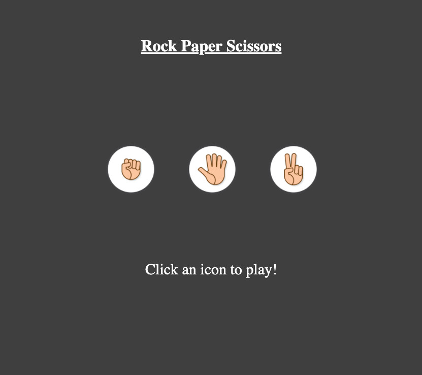

# Rock Paper Scissors

 ### This is a simple Rock Paper Scissors game built using HTML CSS and Vanilla JavaScript.
 
#### You can play the game [here](https://beethoven3579.github.io/My-Rock-Paper-Scissors-App/) 

### This was a less difficult project for me at this stage. However, I still learned plenty form this project. 
The major takeaways were: 1) knowing the proper point in the code to call a function. 2) Creating a random variable. 
3) Changing what is sent to the DOM depending on the random variable. 

## About Me

Nick Paolino -- Full time programming student [LinkedIn](https://www.linkedin.com/in/nick-paolino-00469291/)
